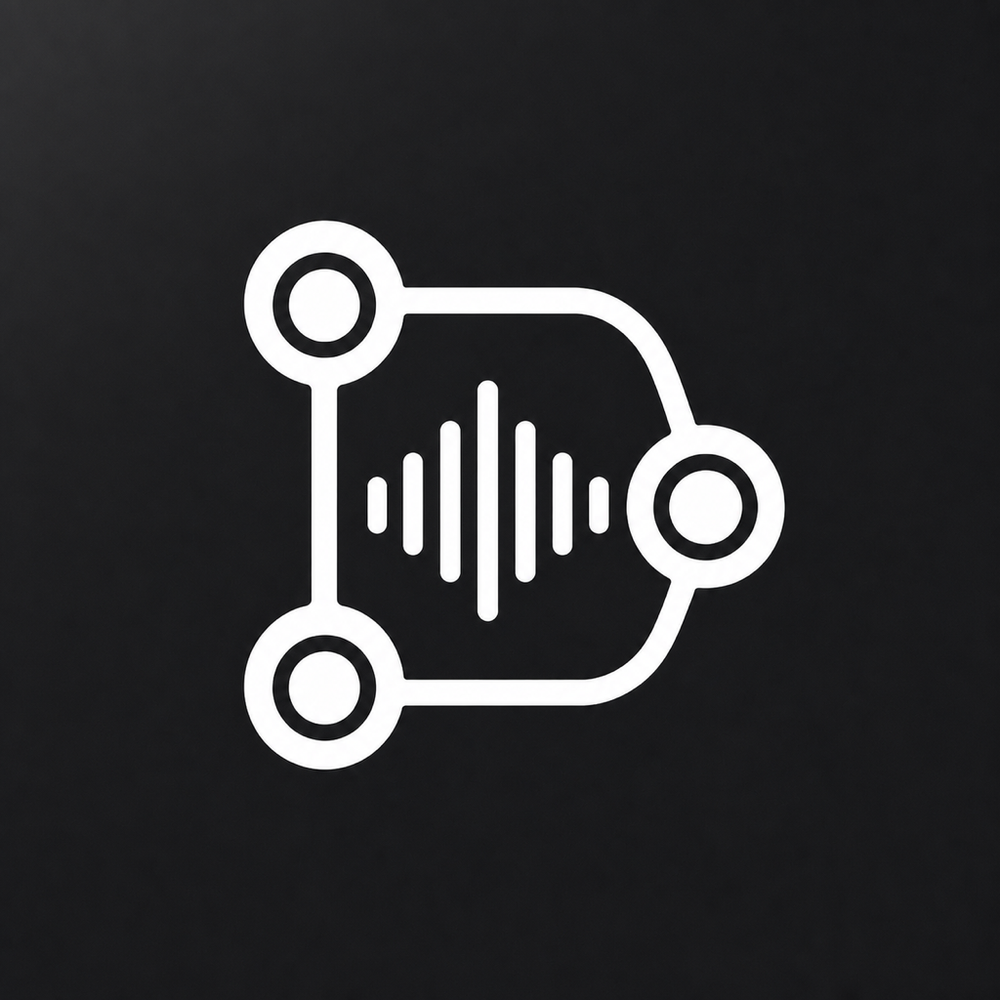
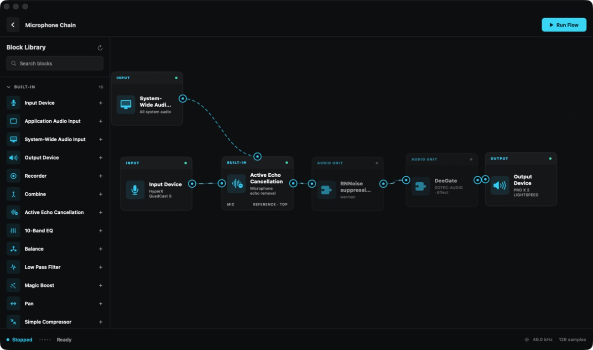

<p align="center">
  
</p>

<h1 align="center">SoundScape</h1>

<p align="center">
  Build, process, record, and route audio with a native visual graph for macOS.
</p>

<p align="center">
  
  
  
  
  
</p>



SoundScape is a node-based audio workstation for routing audio between
microphones, applications, the macOS system, effects, recorders, and hardware
outputs. Build a flow visually, press **Run Flow**, and keep it running in the
background or control it from the menu bar.

## Highlights

| | |
| --- | --- |
| **Visual audio routing** | Connect, branch, combine, move, copy, and edit nodes on an infinite canvas. |
| **Application and system capture** | Capture one application or all audio playing on macOS with ScreenCaptureKit. |
| **AU and VST3 hosting** | Discover installed effects, edit their parameters, embed native plug-in interfaces, and preserve plug-in state. |
| **Realtime echo cancellation** | WebRTC AEC3 removes system playback captured by the microphone with automatic delay and clock alignment. |
| **Native processing** | EQ, filters, compression, gain, balance, pan, mono/stereo conversion, and multi-input combining. |
| **Recording and routing** | Record WAV or CAF files, route to multiple outputs, and select concrete Core Audio devices. |
| **Persistent flows** | Projects, node layouts, settings, and plug-in state are stored locally in SQLite. |
| **Background operation** | Flows continue when the dashboard is closed and remain available from the menu bar. |

## Plug-in support

### Audio Units

SoundScape discovers installed AU Effect and Music Effect components through
the native macOS Audio Unit registry. AU parameters and custom interfaces are
shown directly in the node inspector, and their state is restored with the
flow.

### VST3

VST3 effects are discovered in the standard user, system, network, and bundled
plug-in locations:

- `~/Library/Audio/Plug-Ins/VST3`
- `/Library/Audio/Plug-Ins/VST3`
- `/Network/Library/Audio/Plug-Ins/VST3`
- `SoundScape.app/Contents/VST3`

SoundScape hosts realtime audio processing, parameters, program state, bypass,
and compatible native VST3 editor views.

Third-party plug-ins currently run inside the SoundScape process. A broken or
incompatible plug-in can therefore affect the application, so save important
work before testing a new plug-in.

## Included nodes

- Input Device, Application Audio Input, and System-Wide Audio Input
- Output Device and Recorder
- Active Echo Cancellation and Combine
- 10-Band EQ and Parametric EQ
- Balance, Pan, Volume, and mono-to-stereo conversion
- Low Pass Filter, Magic Boost, and Simple Compressor
- Installed Audio Unit and VST3 effects

## Install

Download `SoundScape.dmg` from the
[latest release](https://github.com/GR0SST/SoundScape/releases/latest), open it,
and drag **SoundScape** onto the **Applications** shortcut.

SoundScape requires:

- macOS 14 or newer
- Microphone access for Input Device nodes
- Screen & System Audio Recording access for application or system capture

Development builds are ad-hoc signed. macOS can request permissions again when
the executable is rebuilt because its code signature changes.

## Build from source

Open `Package.swift` in Xcode and run the `SoundScape` executable target, or use
Swift Package Manager:

```sh
git clone https://github.com/GR0SST/SoundScape.git
cd SoundScape
swift run SoundScape
```

Requirements:

- Xcode with the macOS SDK
- Swift 6 toolchain
- macOS 14 or newer

Create a release app bundle:

```sh
sh Scripts/package-app.sh release
open .build/SoundScape.app
```

Create an installable DMG:

```sh
sh Scripts/package-dmg.sh
open dist/SoundScape.dmg
```

## Project structure

- `Sources/SoundScape` — SwiftUI interface, graph model, audio engine, capture,
  and SQLite storage
- `Sources/CVST3Host` — VST3 scanner and native host bridge
- `Sources/CAECProcessor` — realtime AEC and clock-domain alignment
- `Sources/CSQLite` — SQLite system-library shim
- `Vendor` — vendored realtime DSP dependencies and notices
- `Resources` — app icon and screenshots
- `Scripts` — app/DMG packaging, device auditing, and audio diagnostics
- `Support` — app metadata and entitlements

## Development status

SoundScape is under active development. Bug reports, compatibility notes, and
focused pull requests are welcome.

## License

SoundScape's original source code is available under the
[MIT License](LICENSE). Bundled third-party components remain under their
respective licenses listed in [THIRD_PARTY_NOTICES.md](THIRD_PARTY_NOTICES.md).

VST is a registered trademark of Steinberg Media Technologies GmbH.
